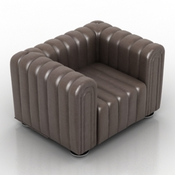

# Idee

Das Thema des Moduls im Wintersemester 2015/16 lautet **Architectual Public Interior** mit der Beschreibung: Visualisierung eines Innenraums entworfen und gebaut für eine öffentliche Verwendung

Ziel des Projekts ist eine Hotel Lobby im Stile des Art Deco. Dabei handelt es sich um die 20er bis 40er Jahre des 20. Jahrhunderts.

Dabei soll der Eindruck entstehen, man befindet sich zu später Abendstunde in einer Hotel Lobby, ein hoher Raum mit gediegener Ausstattung, Gäste unterhalten sich in entspannter Atmosphäre. 

# Basismodell

Die Basis meiner Idee bildet das Modell [Art Deco Grand Hotel Lobby](https://3dwarehouse.sketchup.com/model.html?id=f45c590be18ab64ee9823b596dfb97bd) vom 3D Warehouse User [Daniel P.](https://3dwarehouse.sketchup.com/user.html?id=0887919776644319867265456).

## Fakten des Modells

**Description**:
A fictional 1920's Hotel Lobby with two Entrances, Reception/Front Desk, six Elevators, lots of Lamps, Plants, Sofas and other stuff.

**Sketchup-User**: Daniel P.

**Last Modified**: 03.12.14

**Downloads**: 9.165

**skp File Size**: 2,3 MB

**Polygons**: 15.195

**Materials**: 24

Link: [https://3dwarehouse.sketchup.com/model.html?id=f45c590be18ab64ee9823b596dfb97bd](https://3dwarehouse.sketchup.com/model.html?id=f45c590be18ab64ee9823b596dfb97bd)

## Screenshots

## Modelle
Weiterhin wurde das Basismodell um einige Ausstattungsgegenstände erweitert:

Quelle: [http://archive3d.net/?a=download&id=6dffc037](http://archive3d.net/?a=download&id=6dffc037)

Quelle: [http://archive3d.net/?a=download&id=666c85a4](http://archive3d.net/?a=download&id=6dffc037)

Quelle: [http://archive3d.net/?a=download&id=64b75a0d](http://archive3d.net/?a=download&id=64b75a0d)

Quelle: [https://3dwarehouse.sketchup.com/model.html?id=u8c5ee64c-61a8-4fb3-a57b-3b46c4b5f7fc](https://3dwarehouse.sketchup.com/model.html?id=u8c5ee64c-61a8-4fb3-a57b-3b46c4b5f7fc)

Quelle: [http://archive3d.net/?a=download&id=24e8b872](http://archive3d.net/?a=download&id=24e8b872)
