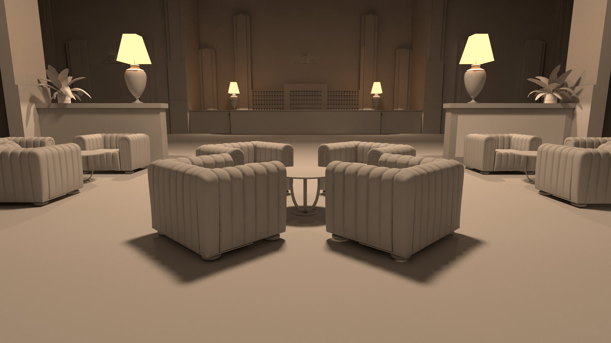

# Lighting

Um die gewünschte Lichtstimmung zu realisieren, werden mehrere kleinere Steh-Lampen eingesetzt. Dazu wird die Szene von vier kleinen Lichtquellen knapp unter der Decke erleuchtet, die eine Art Kronleuchter immitieren sollen. Durch mehrere Lichtquellen erscheinen die Schatten nicht zu kantig.

Zum besseren Anpassen der Lichtstärken der einzelnen Lampen aneinander kommt ein simpler Grau-Shader (Standard VrayMtl) zum Einsatz.

## Steh-Lampen
bestehend aus kleiner VrayLightSphere innen und einem VrayLightMesh für den Lampenschirm

**Anzahl:** 4

**Watt der VrayLightSphere:**

**Watt des VrayLightMesh:**

## Deckenlampen
zwei unterschiedliche Leuchtstärken bei mehreren Positionen

### Kronleuchter-Immitat
**Anzahl:** 4

**Watt der VrayLightSphere:**

### Zusätzliche Lampen als Aufhelllichter
**Anzahl:** 4

**Watt der VrayLightSphere:**

