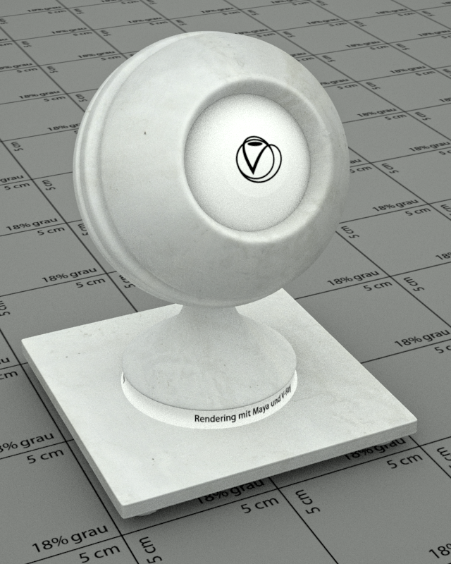

# Materialien

Um die Szene möglichst realistisch zu gestalten, wurden alle verwendeten Materialien von Grund auf kreiert. Im folgenden sind die wichtigsten Materialien aufgeführt.

## Gold-Patina

**Verwendung:**
Goldverzierungen an den Wänden etc. in der Hotel Lobby

**Renderzeit:**
04:06
(800*640 px in Prodution Quality [min:sec])

**Besonderheiten:**
Der Shader besteht aus mehreren einzelnen Vray Mtl und VrayBmp die mit einem VrayBlnd Material zusammengeführt wurden.
Das Material soll eine Gold-Oberfläche mit Patina erzeugen, die ursprünglich mit Blattgott vergoldet wurde.

**Sourceimages:**

**Quellen:**
Original-Textur (diffuse color) von [www.textures.com](http://www.textures.com/download/bronzecopper0037/15872?q=BronzeCopper0037&filter=all)
Datei: BronzeCopper0037_1_S.jpg Textur ist seamless
Größe: 1024 * 1024 px
Sekundäre Texturen ( normals) erzeugt mit CrazyBump

## Kirschholz

**Verwendung:**
Holz der Reception in der Lobby. (Thresen)

**Renderzeit:**
03:16
(800*640 px in Prodution Quality [min:sec])

**Sourceimages:**

**Quellen:**
Original-Textur (diffuse color) von [www.textures.com](http://www.textures.com/download/woodfine0003/14181?q=WoodFine0003&filter=all)
Datei: WoodFine0003_S.jpg
Größe: 1024 * 729 px
Bump Map mit CrazyBump erzeugt

## Lampenfuss

**Verwendung:**
Material des Lampenfuss, der an 4 Stellen in der Hotel Lobby vorkommt

**Renderzeit:**
04:17
(800*640 px in Prodution Quality [min:sec])

**Besonderheiten:**
Für diesen Shader wird keine Textur oder Bump Map verwendet, da der Lampenfuss aus Ceramic besteht

## Leder

**Verwendung:**
Sessel in der Hotel Lobby

**Renderzeit:**

(800*640 px in Prodution Quality [min:sec])

**Besonderheiten:**
Die Farbe der original Textur wurde mittels Photoshop auf die gewünschte Rot-Braune- Tönung geändert

**Sourceimage:**

**Quellen:**
Original-Textur (diffuse color) von [www.textures.com](http://www.textures.com/download/leather0038/15215?q=Leather0038_1&filter=all)
Datei: Leather0038_1_S.jpg Textur ist seamless
Größe: 1024 * 1024 px
Sekundäre Texturen (specular, height, normals) erzeugt mit CrazyBump

## Marmorboden

**Verwendung:**
Marmor Fußboden in der Hotel Lobby

**Renderzeit:**
03:19
(800*640 px in Prodution Quality [min:sec])

**Besonderheiten:**
Die Textur wurde aus Ausschnitten aus einigen Marmor-Texturen erstellt.
Bei dem Vray Material handel es sich um ein FastSSS Material

**Sourceimage:**

**Quellen:**
Original-Textur (diffuse color) von www.textures.com
Dateien: [MarbleWhite0043_M.jpg](http://www.textures.com/download/marblewhite0043/9663?q=MarbleWhite0043_M&filter=all), [MarbleWhite0044_M.jpg](http://www.textures.com/download/marblewhite0044/9664?q=MarbleWhite0044_M&filter=all)
Größe: 1500 x 1500 px
Sekundäre Texturen (specular, normals) erzeugt mit CrazyBump

## Palm

**Verwendung:**
Pflanzen in der Hotel Lobby

**Renderzeit:**
12:49
(800*640 px in Prodution Quality [min:sec])

**Besonderheiten:**
Der Shader wurde direkt am Modell gerendert, damit die Maps richtig eingesetzt werden können.
Der Pflanzentopf wurde mit dem Shader Marmor- Rot versehen
Der "Körper" der Palme wurde mit einer Displacement-Map versehen, um diesen realistischer zu formen

**Sourceimage:**

**Quellen:**
Pflanzentopf aus einem Model von Archive3d.org (Siehe Abschnitt [Idee](idee.md))
Palm 3D Model sowie Textur selbst ebenfalls von Archive3D.org (Siehe Abschnitt [Idee](idee.md))
Die Texturen, Normalmap und Alphamap wurden aus dem Modell übernommen und aufgearbeitet.
Displacement-Map mit Crazybump erzeugt

## Tischholz (Kirschholz)

**Verwendung:**
Tische in der Hotel Lobby

**Renderzeit:**
03:22
(800*640 px in Prodution Quality [min:sec])

**Besonderheiten:**
Der Shader enthält nur die reine Textur und keine Bumpmap oder ähnliches, da es sich um eine Hochglanz Holzoberfläche handelt.

**Sourceimage:**

**Quellen:**
Original-Textur (diffuse color) von [www.textures.com](http://www.textures.com/download/woodfine0036/32970?q=WoodFine0036_M&filter=all)
Datei: WoodFine0036_M.jpg
Größe: 1600 * 498 px

## Türglas

**Verwendung:**
Milchiges Türglas in der Hotel Lobby.

**Renderzeit:**
10:34
(800*640 px in Prodution Quality [min:sec])

**Besonderheiten:**
Für diesen Shader wird keine Textur oder Bump Map verwendet

## Wandfarbe

**Verwendung:**
Farbe/Putz an den Stellen der Wand, an der kein Marmor zum Einsatz kommt.

**Renderzeit:**

(800*640 px in Prodution Quality [min:sec])
03:44
**Besonderheiten:**
Es soll keine Rein-Weiße Wand dargestellt werden, daher die Textur mit ihren leichten Einschlüssen und Dreck.

**Sourceimages:**

**Quellen:**
Original-Textur (diffuse color) von [www.textures.com](http://www.textures.com/download/plasterwhite0149/70866?q=PlasterWhite0149_1_S&filter=all)
Datei: PlasterWhite0149_1_S.jpg
Größe: 1024 * 1024 px
Bump Map mit CrazyBump erzeugt

## Wandmarmor Grün

**Verwendung:**
Grüner Marmor für die Wände in der Hotel Lobby.

**Renderzeit:**
03:25
(800*640 px in Prodution Quality [min:sec])

**Besonderheiten:**
Für diesen Shader wird keine Textur oder Bump Map verwendet.
Um die Marmorstruktur zu Erreichen werden zwei Marble-Materials eingesetzt, bei denen eins der Overall Color des FastSSS zugewiesen und eins der Subsurface Color des FastSSS Materials zugewiesen wird.

## Wandmarmor Rot

**Verwendung:**
Roter Marmor für die Wände und Blumentöpfe in der Hotel Lobby.

**Renderzeit:**
03:31
(800*640 px in Prodution Quality [min:sec])

**Besonderheiten:**
Für diesen Shader wird keine Textur oder Bump Map verwendet.
Um die Marmorstruktur zu Erreichen werden zwei Marble-Materials eingesetzt, bei denen eins der Overall Color des FastSSS zugewiesen und eins der Subsurface Color des FastSSS Materials zugewiesen wird.

## Chrome

**Verwendung:**
Lampenfuß und Couchtischbeine in der HotelLobby

**Renderzeit:**
03:17
(800*640 px in Prodution Quality [min:sec])

**Besonderheiten:**
mit Photoshop erstellte "Scratch"Textur um leichte kratzer im Chrome zu simulieren

**Sourceimages:**

**Quellen:**
Original-Textur für Scratches ist mit Photoshop selbst erstellt
Textur ist seamless
Größe: 4096 * 4096 px
