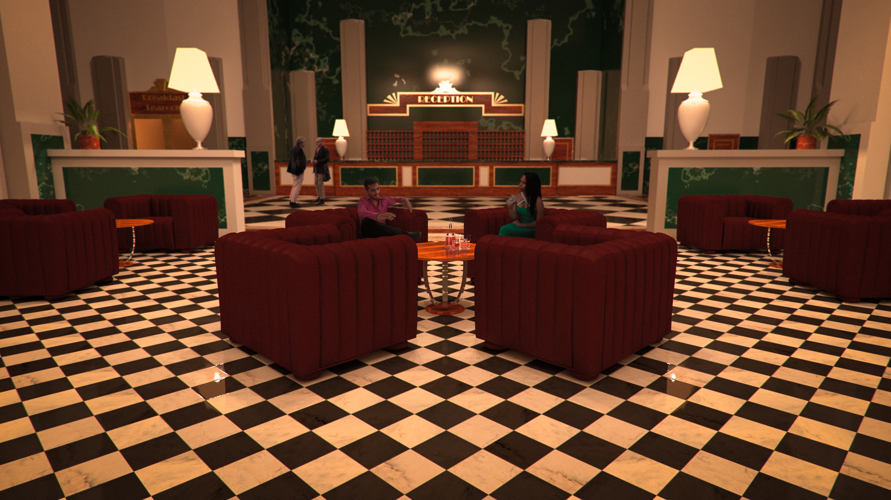
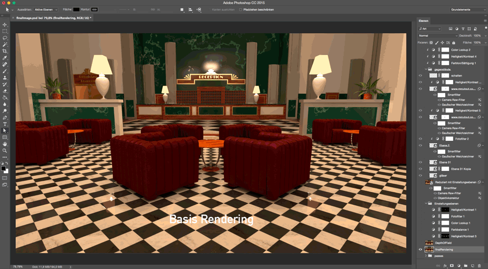
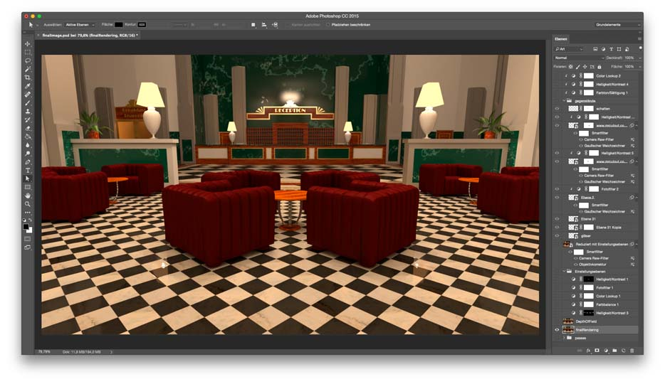
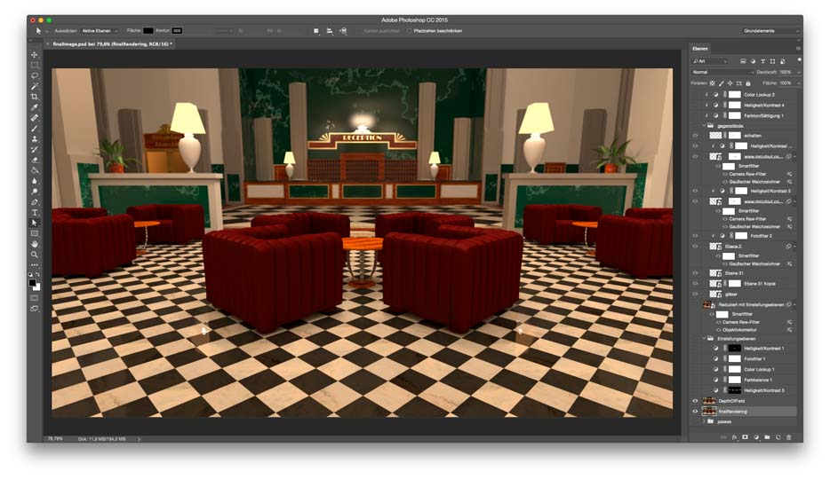
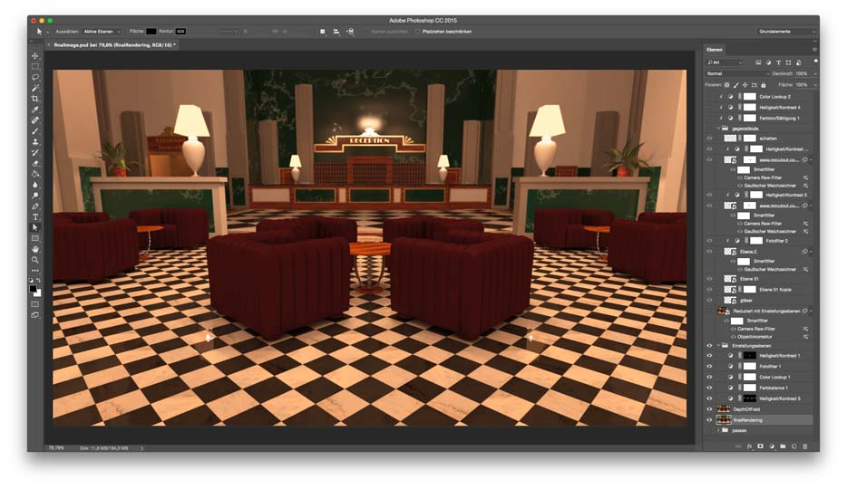
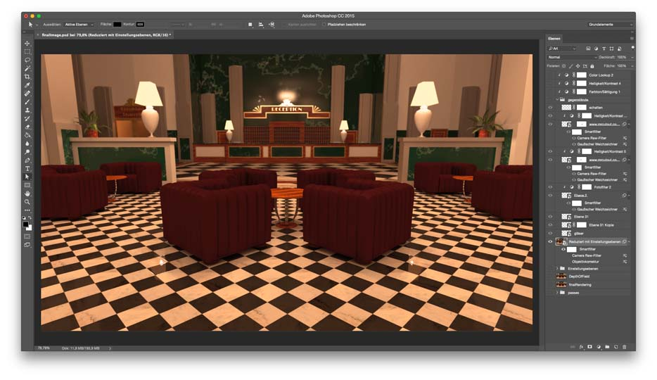
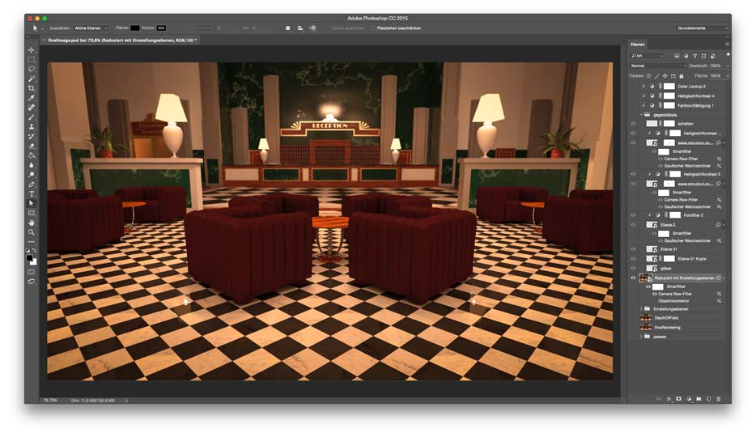
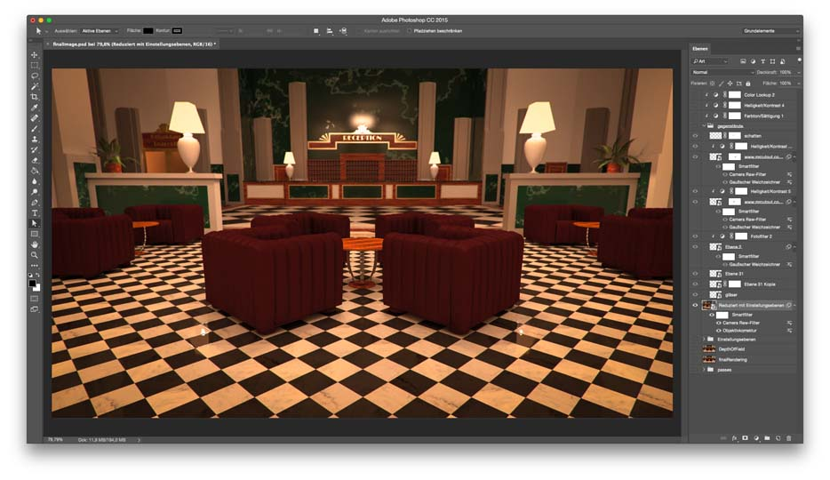
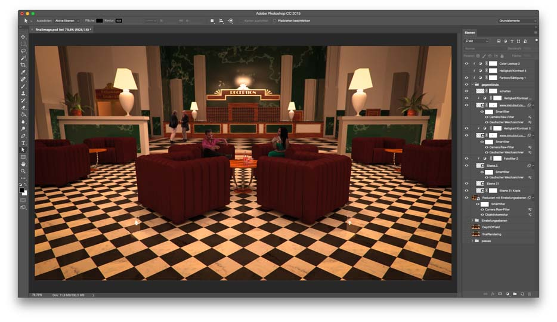

# Post Production

In der Post-Production wurde dem Rendering finale Schliff verliehen. Neben farblichen Anpassungen, leichter Unschärfe und Bild-Verschlechterungen für mehr Realismus, wurden auch CutOuts eingefügt um Leben in die Szene zu bringen.

