# Rendering

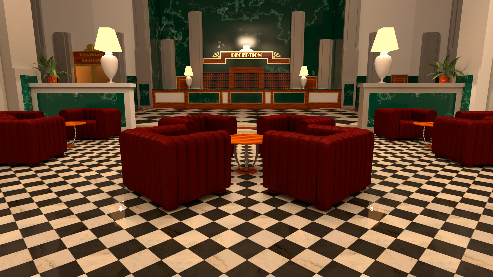

Das finale Rendering erfolgte nachdem alle sichtbaren Materialien in der Szene ausgetauscht wurden. Die Rendersettings wurde so eingestellt, um ein qualitativ hochwertiges Rendering zu erstellen, das möglichst wenig Rauschen enthält. So erlangt man eine gute Ausgangslage für die *Post Production*.

Um das finale Bild zu Rendern kam ein Computer mit den folgenden Daten zum Einsatz:

* Prozessor: Intel i7-870 (4 Kerne, 8 Threads @ 2,93GHz)
* RAM: 4GB
* OS: Windows 7 64bit Professional
* Grafikkarte: ATI Radeon HD 6800

Software:

* Autodesk Maya 2015
* V-Ray for Maya Version 2.40.02
* V-Ray Core Version 2.00.02

Die Renderzeit betrug für das Bild mit einer Auflösung von 1920 x 1080 Pixel 2 Stunden, 26 Minuten und 8 Sekunden.

## Render-Passes
Die folgenden Render-Passes wurden zusätzlich gespeichert, um in der Post-Produktion mehr Spielraum zu haben bzw. um einfach bestimmte Effekte zu Erzeugen.

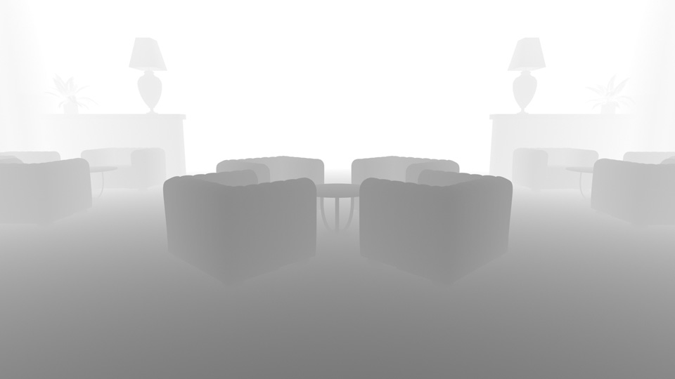

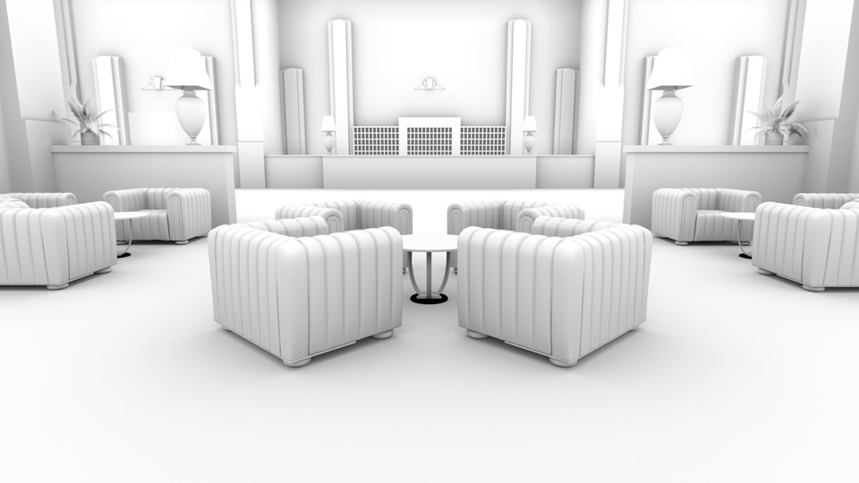

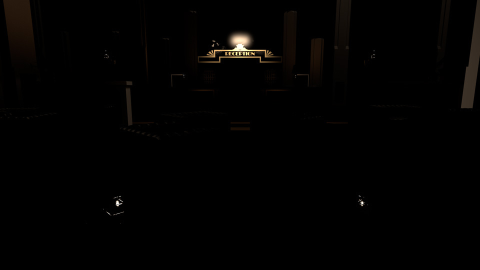

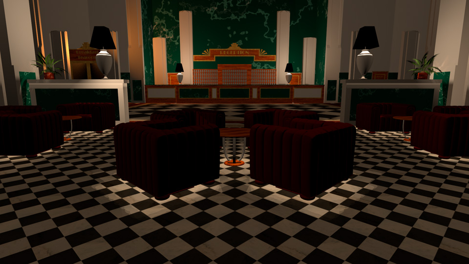

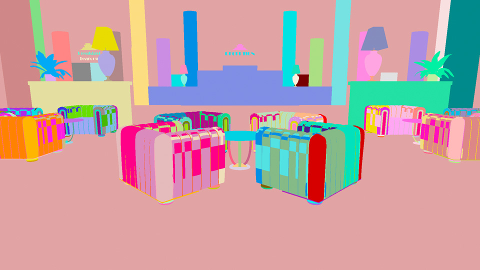

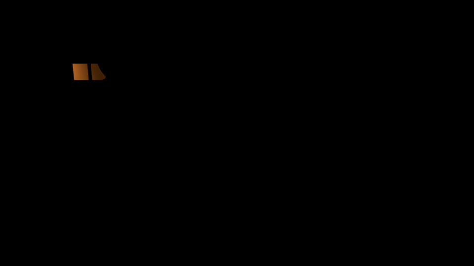

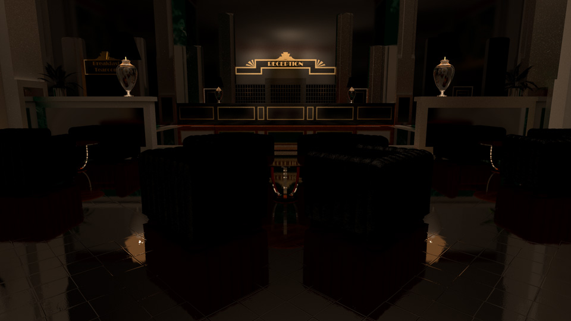

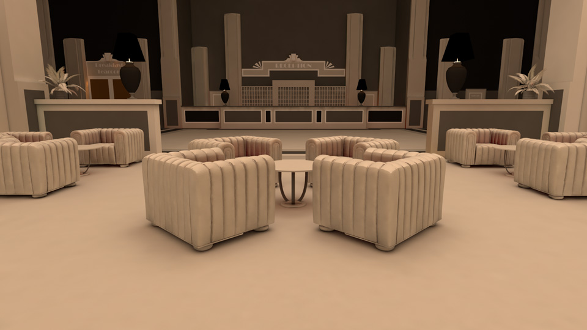

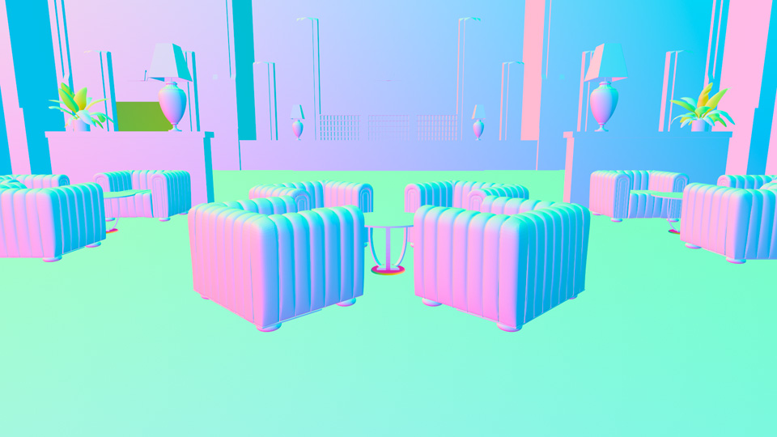

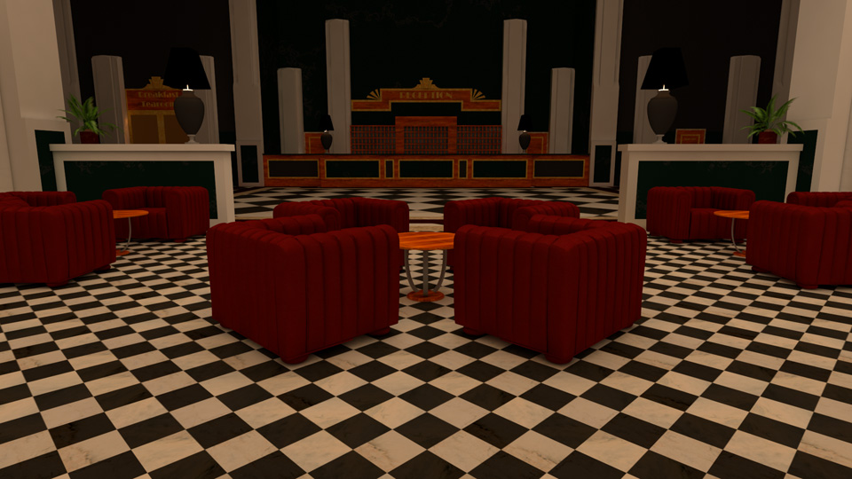

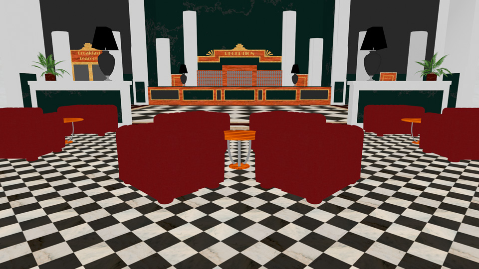

